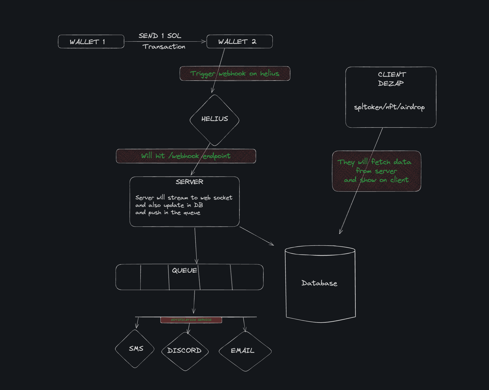

# DeZap

## System Overview

This system is designed to monitor and process Solana blockchain transactions, update a database, and notify users through various channels. It consists of several components:

1. Solana Wallets
2. Helius (Blockchain data provider)
3. Server
4. Database (Postgres)
5. Message Queue (Redis)
6. Notification Services 
7. Client Application (NextJs)

## Architecture Components

### 1. Solana Wallets
- **Wallet 1** and **Wallet 2** represent the source and destination of Solana (SOL) transactions.
- The system tracks transactions of 1 SOL being sent between these wallets.

### 2. Helius
- Helius is used as a blockchain data provider.
- It triggers a webhook when a relevant transaction occurs on the Solana blockchain.

### 3. Server
- Receives webhook notifications from Helius.
- Processes transaction data.
- Updates the database.
- Streams data to connected clients via WebSocket.
- Pushes notifications to the message queue.

### 4. Database (DB)
- Stores transaction data and related information.
- Accessed by both the server and client application(Server Actions).

### 5. Message Queue
- Handles asynchronous processing of notifications.
- Ensures reliable delivery of messages to various notification services.

### 6. Notification Services
- **SMS**: Send text message notifications.
- **Discord**: Send notifications to a Discord channel.
- **Email**: Send email notifications to users.
- **Telegram**: Send Telegram notifications to users.

### 7. Client Application
- A NextJs App that interacts with the Database.
- Fetches and displays transaction data from the server.

## Data Flow

1. A transaction of 1 SOL is sent from Wallet 1 to Wallet 2.
2. Helius detects this transaction and triggers a webhook to the server.
3. The server processes the webhook data and:
   - Updates the database
   - Streams the data to connected clients via WebSocket
   - Pushes a notification to the message queue
4. The message queue distributes the notification to SMS, Telegram, Discord, and Email services.
5. The client application fetches updated data from the server and displays it to the user.

## Client Application

The client provides the following features:
- Real-time display of tracked Solana transactions
- Managing your connected services where you want to receive notifications

